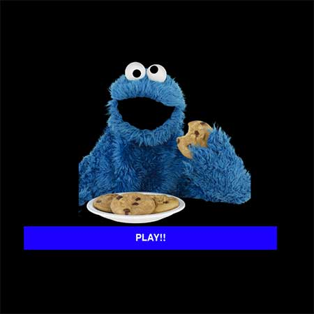

Cookie Monster PyGame
=====================

## About  
Cookie Monster PyGame is a simple dodge and catch game. The goal is to help Cookie Monster collect cookies while avoiding bombs.  The player will use their mouse or trackpad to maneuver Cookie Monster around a game board of cookies and bombs that fall at different speeds.  If the player collects 15 cookies, they win.  If a player hits a falling bomb, then they lose all their cookies and they have to collect 15 more.  If a player gets hit by a falling bomb 5 times, then the game is over.


## Technologies Used  
- Python
- PyGame


## Game Walkthrough  
1) Game Load Screen
<p align="left" >
  
</p>
2) Game Board Screen
<p align="left">
  
</p>
3) Game Over Screen
<p align="left">
  
</p>

## Challenges  

- Being new to Object Oriented Programming, implementing Classes in Python proved to be a bit difficult.  Originally, the game was coded using all functions. (Below is a code snippet for the Falling Object Class that I created to add new cookies or bombs to the screen.)

```
class Falling_Object(object):
    def __init__(self, item_type, item_drop_speed):
        self.item_type = item_type
        self.item_drop_speed = item_drop_speed
        self.size = 30
        self.x_pos = random.randint(0, SCREEN_WIDTH - self.size)
        self.y_pos = (0 - self.size)

    def update_y_position(self):
        self.y_pos += self.item_drop_speed

    def get_image(self):
        if self.item_type == 'cookie':
            return falling_cookie_image
        elif self.item_type == 'bomb':
            return falling_bomb_image

    def transform_image_size(self):
        image = self.get_image()
        transformed_image = pygame.transform.scale(image, (self.size, self.size))
        return transformed_image

    def image_rectangle(self):
        return pygame.Rect(self.x_pos, self.y_pos, self.size, self.size)

    def render_image(self, screen):
        image = self.get_image()
        transformed_image = self.transform_image_size()
        image_rect = self.image_rectangle()
        screen.blit(transformed_image, image_rect)
```
## Demo  

  <div style="position:absolute; left: 50px;">
    <a href="https://youtu.be/QQ3vjUYUUmo" target="_blank" left='30px'>
      
    </a>
  </div>